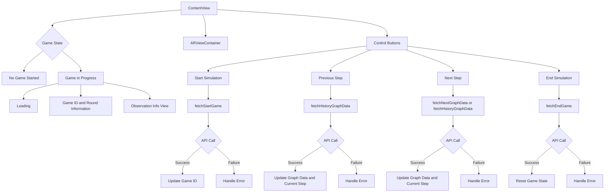
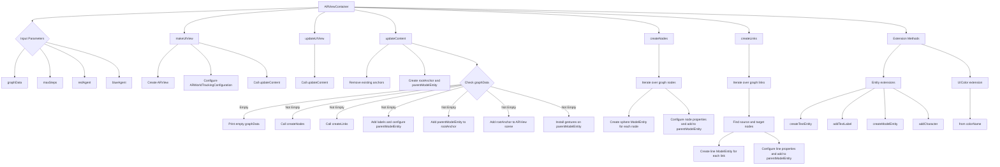
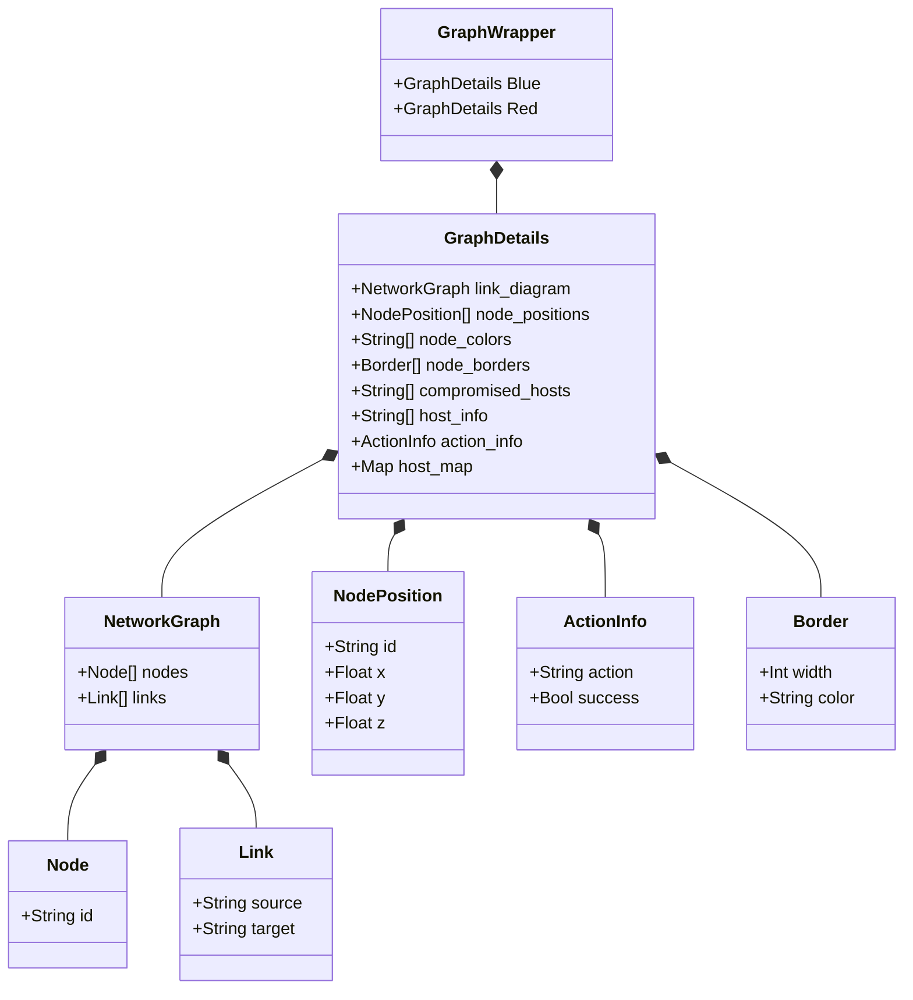

# iOS App for Visualizing Network Simulation and Cyber Operations Research Gym (CybORG) Interaction

## Setup Instructions
1. Download Xcode
2. Clone the repository: `git clone https://github.com/justinyeh1995/CybORG-ARViz.git`
 
## Running the App
To run the app on your device, follow these steps:

1. Open the project in Xcode.
2. Connect your iOS device(I'm using iPad 10th gen) via USB or USBC.
3. Select your device from the target dropdown in Xcode.
4. Click Run to build and deploy the application to your device.
   

## App Procedure

1. Press the start ▶ button to initialize a new game. If the game is successfully initialized, an ID will be displayed.
2. Click the next ⏭️ button to start the first step of the game.
3. Once you reach round 2, you can press the previous step ⏮️ button to view historical data.
4. Rotation of the network is supported. You can rotate the network to view it from different angles.
5. Translation of the network within the scene is supported. You can move the network around the scene. 
6. Scaling of the network within the scene is supported. You can zoom in or out to adjust the size of the network.
7. Press the end ⏹️ button to end the current game.

Please note that user sessions are not currently supported.

## Video Demonstration

[Youtube Link](https://youtu.be/E2JiSItib-Q?si=q2yf9qpUFhBArBvd)

https://github.com/justinyeh1995/CybORG-ARViz/assets/42970023/2b8e19d8-1ccc-44fe-86a1-a7e5f4a06bb3

## Project Description

### 1. Objective:
This project seeks to innovate in the field of cyber operations research by employing ARKit to develop an immersive tool for visualizing the results of the Cyber Operations Research Gym (CybORG) games on iOS devices. Acknowledging the challenge of presenting the complex, dynamic outcomes of CybORG simulations on conventional displays, our initiative aims to leverage augmented reality's spatial and interactive capabilities. This approach will transform how users comprehend and analyze CybORG game outcomes, making detailed cyber operations data more accessible, engaging, and understandable.

### 2. Technology Stack:
AR Technology: Utilizing ARKit, with a focus on its advanced world tracking, plane detection, and spatial anchoring features, to create stable and interactive AR experiences tailored for visualizing CybORG game data.
Development Environment: Xcode
Data Integration: Implementing REST API calls to fetch real-time or historical CybORG game results, ensuring the visualization accurately reflects the nuanced dynamics of cyber operations simulations.

Technical Implementation in ARKit:
- Swift & SwitUI for iOS dev
- RealityKit for 3D Models rendering.
- ARKit Plane Detection: Use ARKit’s plane detection to place the network simulation on a flat surface, like a table or floor, allowing users to view it from a comfortable perspective.
- Touch Gestures: Implement gesture recognition to allow users to interact with the network.
 - Simple gestures like a tap could reveal more information, and pinch or swipe gestures could navigate through simulation steps or scale the visualization.
   

Backend API Service Code can be found at: \
https://github.com/justinyeh1995/CybORG-live/blob/main/src/api/v1/CybORG/CybORG/FastAPI/fastapi_index.py

### 3. Project Scope:
1. CybORG Data Visualization: Creating an intuitive AR interface that allows users to navigate and interact with 3D representations of CybORG game results, highlighting key metrics, attack vectors, and defense mechanisms within a cyber operations scenario.
2. Adaptive Display for Detailed Analysis: The application will enable users to scale and manipulate the spatial visualization of game results, accommodating the need for detailed analysis without being constrained by the screen size limitations of iPhones and iPads.

### 4. Class Diagrams for Important Components

`ContentView.swift`

`ARViewContainer.swift`

`GraphWrapper.swift`

## Referneces

Generating 3D objects
- https://sketchfab.com/

SwiftUI
- [2023 | CS193p - Developing Apps for iOS](https://cs193p.sites.stanford.edu/2023)
- https://developer.apple.com/tutorials/swiftui
- https://www.hackingwithswift.com/books/ios-swiftui/
- https://www.youtube.com/@SwiftfulThinking
- https://www.swiftful-thinking.com/blog

ARKit
- https://developer.apple.com/documentation/arkit/arkit_in_ios

USDZ 
- https://developer.apple.com/augmented-reality/quick-look/

RealityKit
- https://divalue.github.io/Awesome-RealityKit/
- https://developer.apple.com/documentation/realitykit/
- https://www.youtube.com/watch?v=nBZ-dglGow0&list=PLBv1NzmBcY51I2qFurJv8Kk5jw1JIJeeY
- https://www.youtube.com/watch?v=qGksl5tLE-8
- https://www.youtube.com/watch?v=9R_G0EI-UoI
- https://betterprogramming.pub/how-to-add-text-to-an-arview-in-an-ios-application-tutorial-f3f746f4dc1f
- https://www.ralfebert.com/ios/realitykit-dice-tutorial/

Handling gestures
- https://www.hackingwithswift.com/articles/71/how-to-use-the-coordinator-pattern-in-ios-apps
- https://www.youtube.com/watch?v=g4UHwTqnDIY&t=401s
- https://www.createwithswift.com/using-realitykit-gestures-in-an-ar-application-with-swiftui/#:~:text=Gestures%20for%20rotation%2C%20scaling%20and,supported%20gestures%20installed%20on%20it
